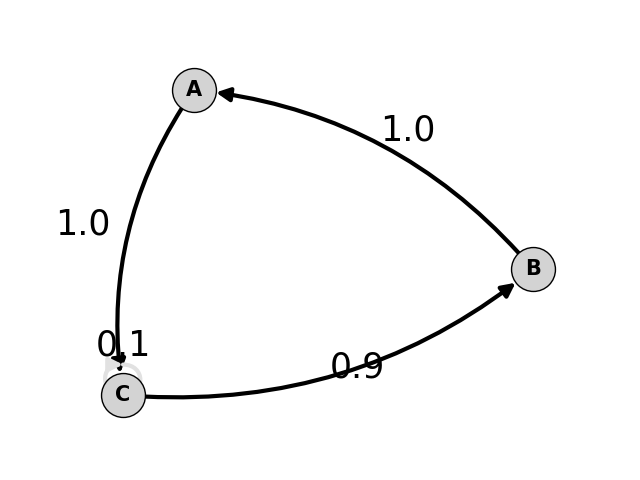
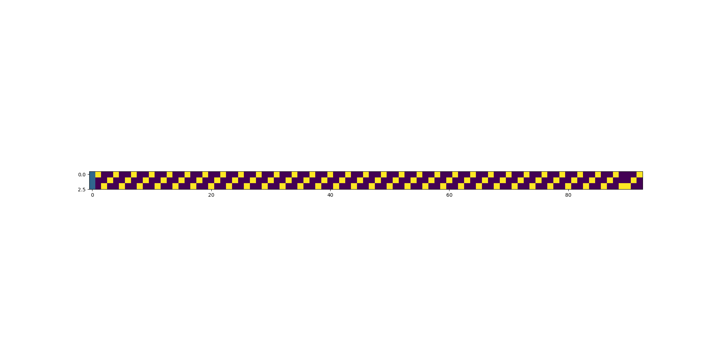
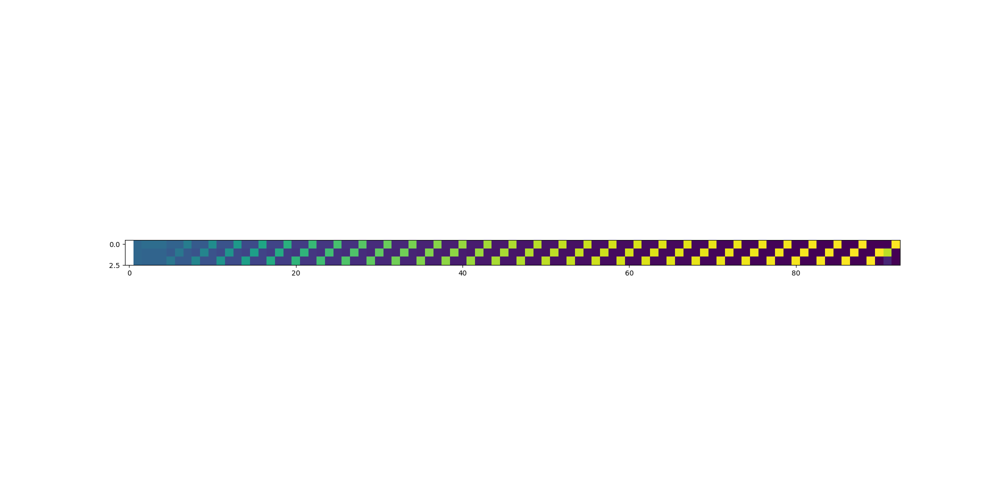

# SLIM

Simultaneous Learning and Inference Model


## Features

The SLIM model can
* learn state transitions within noisy, stochastic, and non-stationary environments,
* capture regularities that span different timescales,
* explain empirical results related to predictive processing,
* guide hypotheses about predictive processing.

## Installation

You can install the model using pip. After cloning/downloading the package, navigate to `/path/to/SLIM/` and run the following:

```bash
pip install .
```

## Quick Start (Tutorial)

This short tutorial shows a common use case.

### 1. Import the package

```python
from slim.model import SLIM

import numpy as np
import matplotlib.pyplot as plt
```

### 2. Create a sequence of states

```python
# create 30 repititions of states 1-0-2 followed by 2-1-0
sequence = [1, 0, 2] * 30 + [2, 1, 0]
```

### 3. Build model

```python
model = SLIM(dim=3, sensor=np.eye(3))  # here we assume ideal observation.
```

### 3. Train model

```python
model.fit(sequence, learning_rate=0.1)
```

or equivalently

```python
for x in sequence:
    y = model.observe(x)
    model.step(y, learning_rate=0.1)

```

The latter gives you more flexibility, e.g. for adjusting the sensor at each iteration.

### 4. Analyse results

```python
plt.figure(figsize=(20,1))
plt.plot(np.array(model.state_prediction_errors))
plt.savefig('./docs/state_prediction_errors.png')
```


Note that state prediction errors are not directly used in the model, Instead we use a more informative signal which is an error of the transitions, i.e. *inferred - expected* transition. We call this signal a context weighted error potential. It can be read using `model.context_weighted_error_potential`. Note that the norm of this signal is equivalent to the `state_prediction_error`.

Learned Representation
```python
from slim import viz
viz.create_digraph(model, states=['A','B','C'], axis=plt.subplot())
plt.savefig('./docs/learned_model.png')
```



Beliefs (Posteriors)
```python
plt.figure(figsize=(20,10))
plt.imshow(model.bel.T)
plt.savefig('./docs/model_beliefs.png')
```


Predictions 
```python
plt.figure(figsize=(20,10))
plt.imshow(np.array(model.x_hat_hist).T)
plt.savefig('./docs/model_predictions.png')
```


## License

CC BY-NC-ND 4.0

